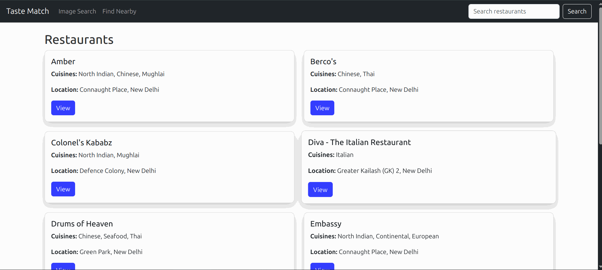

# Taste Match Restaurant Listing & Search App

A full-stack web application to explore, search, and filter restaurants using real Zomato dataset. Includes location-based discovery, image-based cuisine search, and detailed restaurant views.

---

## Features

* Load & store Zomato dataset into database
* REST API to:

  * Get restaurant by ID
  * List restaurants with pagination
* Web UI (Jinja + Bootstrap) for:

  * Home page with restaurant cards
  * Individual restaurant detail view
  * Text search by name or description
  * Search by location (latitude, longitude, radius)
  * Image upload → cuisine detection (CLIP model)
* Filters:

  * Country
  * Average cost for two
* Pagination on all pages

---

## Tech Stack

* **Backend**: FastAPI + SQLAlchemy
* **Frontend**: Jinja2 + Bootstrap
* **Database**: SQLite 
* **AI Model**: OpenAI CLIP (image → cuisine detection)
* **Others**: Pydantic, Uvicorn

---

## Setup Instructions

1. **Clone the repo**

   ```bash
   git clone <your-repo-url>
   cd zomato-search-app
   ```

2. **Create virtual environment**

   ```bash
   python3 -m venv venv
   source venv/bin/activate
   ```

3. **Install dependencies**

   ```bash
   pip install -r requirements.txt
   ```

4. **Load dataset**

   ```bash
   python scripts/load_data.py
   ```

5. **Run the server**

   ```bash
   uvicorn app.main:app --reload
   ```

6. **Access the app**

   * Web UI: [http://127.0.0.1:8000](http://127.0.0.1:8000)
   * Swagger Docs: [http://127.0.0.1:8000/docs](http://127.0.0.1:8000/docs)

---

## Project Structure

```
.
├── app/
│   ├── main.py             # FastAPI entrypoint
│   ├── models.py           # SQLAlchemy models
│   ├── schemas.py          # Pydantic schemas
│   ├── crud.py             # Database access layer
│   ├── utils/              # CLIP, helpers
│   ├── templates/          # HTML templates (Jinja2)
│   └── static/             # CSS & assets
├── scripts/
│   └── load_data.py        # Load CSV into DB
├── requirements.txt
└── README.md
```

---

## Quick Demo
